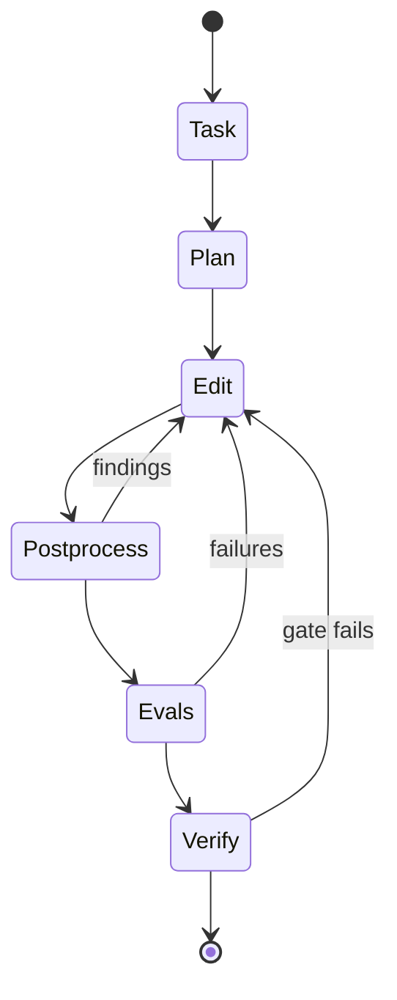

# Agent Architecture

This template treats the agent as a small system with explicit states, audit trails, and layered guardrails.

## Runtime Model

1. receive a task
2. classify the risk tier
3. plan the smallest in-scope diff
4. edit files
5. run postprocess checks if the diff is risky or agent-generated
6. run evals when behavior, safety, or review workflow changed
7. run the required verification command
8. stop only when everything is green



## Trace Format

Use JSONL for lightweight traces. One event per line keeps the format easy to append, grep, and archive.

Recommended fields:

- `timestamp`
- `task_id`
- `risk_tier`
- `state`
- `tool`
- `target`
- `result`
- `notes`

Example:

```json
{"timestamp":"2026-04-18T12:00:00Z","task_id":"abc123","risk_tier":"medium","state":"edit","tool":"apply_patch","target":"docs/risk-tiers.md","result":"ok"}
```

## Guardrail Stack

| Layer | Purpose | Examples |
| --- | --- | --- |
| Policy | Decide what is allowed | risk tiers, protected files, human approval |
| Capability gating | Limit what the agent can touch | only the repo root, no secrets, least-privilege tools |
| Postprocess | Catch dangerous diffs before finalization | `.env` changes, workflow edits, dependency updates |
| Evals | Check behavior and safety | accuracy, prompt injection, jailbreaks, regression cases |
| Verification | Prove the repo is green | `./scripts/run_required_checks.sh` |

## Threats and Mitigations

| Threat | Mitigation |
| --- | --- |
| Prompt injection in docs or web content | Treat content as data, not instructions; keep `AGENTS.md` authoritative |
| Secret exfiltration | Never surface secrets in prompts, logs, or docs |
| Tool misuse | Use the smallest command set possible and gate dangerous actions |
| Irreversible changes | Require human review for high-risk work |
| Hidden regressions | Add or update evals and keep the verification gate green |

## Portable Defaults

- keep the public entrypoint small
- keep the gate deterministic
- prefer explicit state transitions over implicit behavior
- make new guardrails visible in docs before relying on them operationally
